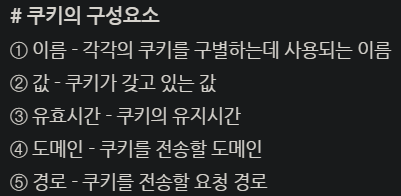
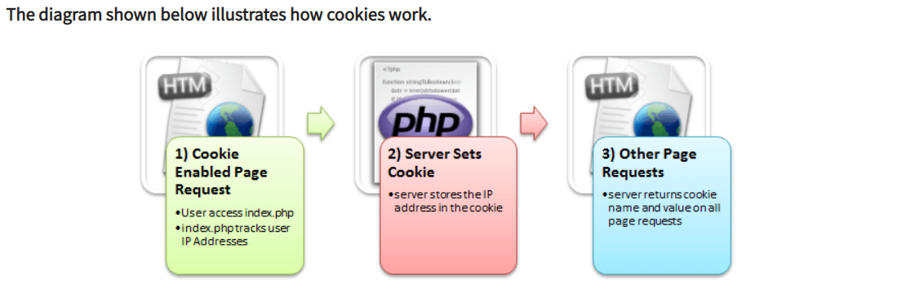

# 0509 1일 2개념

### 1. 세션과 쿠키의 사용 이유 + 캐시

(1) 사용 이유

- **Cookies** and **Sessions** are **used** to store information. **Cookies** are only stored on the client-side machine, while **sessions** get stored on the client as well as a server. A **session** creates a file in a temporary directory on the server where registered **session** variables and their values are stored.

- 정보를 저장하기 위해 사용된다.
- 서버와 클라이언트가 통신을 할 때마다 서버는 클라이언트가 누구인지 인증을 계속 해야한다.
- 그 이유는 HTTP 프로토콜이 Connectionless, Stateless 특성이 있기 때문.
  - connectionless : 클라이언트가 요청을 한 후 응답을 받으면 그 연결을 끊어버림
  - stateless : 통신이 끝나면 상태를 유지하지 않는 특징

(2) 쿠키, 세션, 캐시

- 쿠키 : client side machine에 정보를 저장.

  

  - 사용자가 특정 웹사이트를 방문했을 때 남는 이용 기록 등을 브라우저에 저장한 파일을 지칭한다. 
  - 동화 ‘헨젤과 그레텔'에서 주인공이 길을 지나며 남긴 빵 부스러기와 같다고 해서 붙여진 이름이다. 
  - 쿠키는 사용자가 인터넷을 이용할 때 편리한 도구이지만 다른 한편으로는 광고주가 인터넷 사용자를 추적하는 방법으로도 널리 사용된다. 이러한 이유로 구글, 애플, 모질라 등은 3rd party cookie를 중단하는 추세이다.
    - 크롬 블로그 내용 : https://blog.chromium.org/2020/01/building-more-private-web-path-towards.html

- 

  

- 세션 : client side machine 뿐만 아니라 서버에도 정보를 저장! 서버에 있는 쿠키라고 생각하면 된다.

  - 클라이언트를 구분하기 위해 세션ID를 부여하며 웹 브라우저가 서버에 접속해서 브라우저를 종료할 때까지 인증상태 유지
  - 사용자 정보를 서버에 저장하기 때문에 쿠키보다는 보안에 좋지만, 사용자가 많아질수록 서버 메모리가 많이 차지하게 되거나 과부하를 줄 수 있다.

- 캐시 : 파일을 저장한다. ex) js/css 파일 등은 매번 들어와도 똑같으므로 저장해놓는다. 서버 자원을 아낄 수 있고 속도도 향상됨!

### 2. 데이터베이스에서 인덱스란?

A `database index` is a data structure that improves the speed of data retrieval operations on a database table at the cost of additional writes and storage space to maintain the index data structure.

- 인덱스는 단순히 특정 열에 정보를 저장하는 데이터 구조를 뜻한다. 테이블 열에 생성되어 추가적인 작업이나 데이터를 불러오는 동작에 있어 속도를 향상시키는 역할을 한다.

