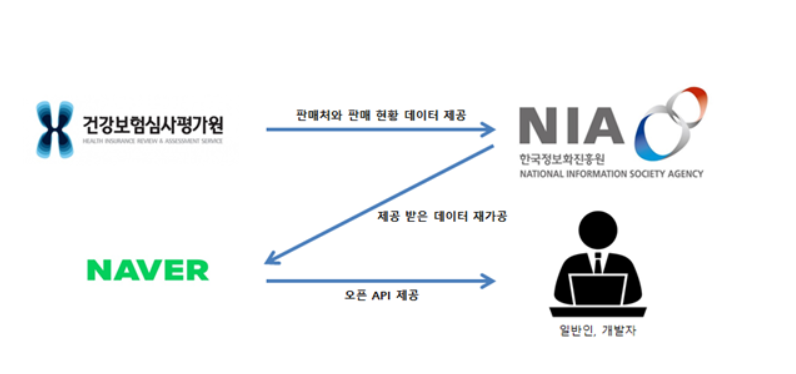
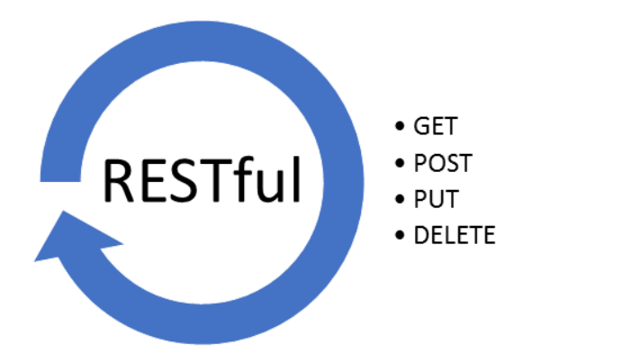

# 2020.05.11 1일 2개념

### 1. API(Application Programming Interface)

> Application (응용 프로그램)
>
> Programming(프로그래밍)
>
> Interface(인터페이스) : 두 물체, 공간 등의 공통 접점면으로, __독립되고 관계가 없는 시스템이 접촉하거나 통신이 일어나는 부분!!!!!!!!!!__

- `라이브러리에 접근하기 위한 규칙`들을 정의한 것! 프로그래머가 라이브러리가 제공하는 여러 함수를 이용하여 프로그램을 작성할 때 해당 함수의 내부구조는 알 필요없이 단순히 API에 정의된 입력 값을 주고 결과 값을 사용할 수 있게 해준다.

  쉽게 말하면, 특정 프로그램의 데이터에 다른 프로그램이 접근할 수 있도록 미리 정한 통신기술!

- 예시 - 코로나 마스크 맵

  

  - 이런 API를 개방한 것을 **'오픈API'**라고 하여,
    **데이터 또는 플랫폼을 외부에 공개하고**
    **외부 프로그램 개발자와 사용자가 이를 활용해**
    **새롭고 다양한 서비스를 만들어 내는 것**이라고 생각하면 된다.
    - 출처 : https://m.post.naver.com/viewer/postView.nhn?volumeNo=27800881&memberNo=40974286&vType=VERTICAL

- 오픈 API는 이용자, 제공자 모두에게 이익을 가져다준다.
  - 제공자 : 플랫폼을 외부로 확장 가능
  - 이용자 : 필요한 기능을 사용하거나 데이터를 제공받을 수 있음.
- 참고할만한 사이트(데이터 얻을 수 있는 사이트) : https://www.data.go.kr/

- Redoc, swagger : API 공식문서 만드는 도구

### 2. RESTful API

> Representational State Transfer

