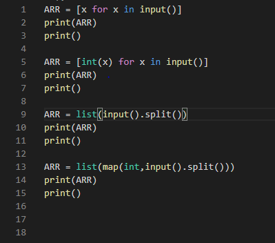
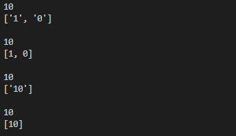

20200130


# 알고리즘 

-알고리즘 : 유한한 단계를 통해 문제를 해결하기 위한 절차나 방법이다.

주로 컴퓨터용어로 쓰이며, 컴퓨터가 어떤 일을 수행하기 위한 단계적 방법을 말한다.

-어떠한 문제를 해결하기 위한 절차


### 알고리즘을 표현하는 방법 2가지

- 슈더코드(내가 알고있는 문법이나 자연어로)

  - 규칙이 없다

  - 사람들과 협업시/ 오류 발생 후 유지보수 시 등 유용하게 쓰일 것이다.

- 순서도

  - 규칙이 있다
    - 네모 : 명령 / 마름모 : 조건문 / 화살표 등


### 알고리즘의 성능 측정

 APS 과정의 목표 중의 하나는 보다 좋은 알고리즘을 이해하고 활용하는 것이다.

- 무엇이 좋은 알고리즘일까?
  - 정확성 : 얼마나 정확하게 동작하는가?
  - 작업량 : 얼마나 적은 연산으로 원하는 결과를 얻어내는가?
  - 메모리 : 얼마나 적은 메모리를 사용하는가?
  - 단순성 : 얼마나 단순한가?
  - 최적성 : 더 이상 개선할 여지없이 최적화 되었는가?


- 주어진 문제를 해결하기 위해 여러 개의 다양한 알고리즘이 가능

  => 어떤 알고리즘을 사용해야 하는가?

- 알고리즘의 성능 분석 필요

  - 많은 문제에서 성능 분석의 기준으로 알고리즘의 작업량을 비교한다.

    ex) 1부터 100까지 합을 구하는 문제

    - 1~100까지 더하면: 100번의 연산
    - 식 사용하면 [n(n+1)/2 ] : 3번의 연산


- 알고리즘의 작업량을 표현할 때 시간복잡도로 표현한다.

- 시간 복잡도(Time Complexity)

  실제 걸리는 시간을 측정

  실행되는 명령문의 개수를 계산

  - 빅-오(O) 표기법
    - 시간 복잡도 함수 중에서 가장 큰 영향력을 주는 n에 대한 항만을 표시
    - 계수(Coefficient)는 생략하여 표시

  - 요소 수가 증가함에 따라 알고리즘은 1, logn, n, nlogn, n^2, 2^n, n! 등의 연산 수를 보인다.
  - 반복문이 중첩 될수록 성능은 급격하게 떨어진다.

  - 시간 복잡도별 실제 실행 시간


### 배열

- 배열이란?
  - 일정한 자료형의 변수들을 하나의 이름으로 열거하여 사용하는 자료구조
  - 아래의 예는 6개의 변수를 사용해야 하는 경우, 이를 배열로 바꾸어 사용하는 것이다.

- 배열의 필요성
  - 배열을 사용하면 하나의 선언을 통해서 둘 이상의 변수를 선언할 수 있다.


- ARR = [x for x in input()] => 1234ab --> '1','2','3','4',a,b

  ARR = [int(x) for x in input()]

  ARR = list(input().split())

  ARR = list(map(int, input().split()))

  

  

- for i in range(4)

  for i in range(len(arr))  // 가장 많이 쓰인다

  for i in arr


### 완전 검색 (Baby-gin)

- 완전 검색 방법은 문제의 해법으로 생각할 수 있는 모든 경우의 수를 나열해보고 확인하는 기법이다.

  Brute-force 혹은 Generate-and-test 기법이라고도 불리 운다.

  모든 경우의 수를 테스트 한 후 최종 해법을 도출한다.

  일반적으로 경우의 수가 상대적으로 작을 때 유용하다.

- 모든 경우의 수를 생성하고 테스트 하기 때문에 수행 속도는 느리지만, 해답은 찾아내지 못할 확률이 작다.

- 자격검정평가 등에서 주어진 문제를 풀 때, 우선 완전 검색으로 접근하여 해답을 도출한 후, 성능 개선을 위해 다른 알고리즘을 사용하고 해답을 확인하는 것이 바람직하다.

- 순열 생성 방법 참고

  ```python
  ARR = [int(x) for x in input()]
  
  for i1 in range(3):
      for i2 in range(3):
          if i2 != i1 :
              for i3 in range(3):
                  if i3 != i1 and i3 != i2 :
                      print(i1,i2,i3,ARR[i1],ARR[i2],ARR[i3])
  ```

  


### 탐욕 알고리즘

- 최적해를 구하는 데 사용되는 근시안적인 방법
- 여러 경우 중 하나를 결정해야 할 때마다 그 순간에 최적이라고 생각되는 것을 선택해 나가는 방식
- 각 선택의 시점에서 이루어지는 결정은 지역적으로는 최적이지만, 그 선택들을 계속 수집하여 최종적인 해답을 만들었다고 하여, 그것이 최적이라는 보장은 없다.
- 일반적으로 머릿속에 떠오르는 생각을 검증 없이 바로 구현하면 Greedy 접근이 된다.